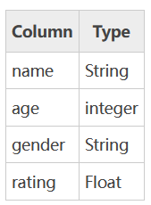

# DataFrame数据类型

DataFrame 是 Pandas 的重要数据结构之一，也是在使用 Pandas 进行数据分析过程中最常用的结构之一，可以这么说，掌握了 DataFrame 的用法，你就拥有了学习数据分析的基本能力。

### 认识DataFrame结构
 
DataFrame 一个表格型的数据结构，既有行标签（index），又有列标签（columns），它也被称异构数据表，所谓异构，指的是表格中每列的数据类型可以不同，比如可以是字符串、整型或者浮点型等。其结构图示意图，如下所示：


表格中展示了某个销售团队个人信息和绩效评级（rating）的相关数据。数据以行和列形式来表示，其中每一列表示一个属性，而每一行表示一个条目的信息。

下表展示了上述表格中每一列标签所描述数据的数据类型，如下所示：




DataFrame 的每一列数据都可以看成一个 Series 结构，只不过，DataFrame 为每列数据值增加了一个列标签。因此 DataFrame 其实是从 Series 的基础上演变而来,并且他们有相同的标签,在数据分析任务中 DataFrame 的应用非常广泛，因为它描述数据的更为清晰、直观。

通过示例对  DataFrame 结构做进一步讲解。 下面展示了一张学生评分表，如下所示：


同 Series 一样，DataFrame 自带行标签索引，默认为“隐式索引”即从 0 开始依次递增，行标签与 DataFrame 中的数据项一一对应。上述表格的行标签从 0 到 3，共记录了 4 条数据（图中将行标签省略）。当然你也可以用“显式索引”的方式来设置行标签。

下面对 DataFrame 数据结构的特点做简单地总结，如下所示：

- DataFrame 每一列的标签值允许使用不同的数据类型；
- DataFrame 是表格型的数据结构，具有行和列；
- DataFrame 中的每个数据值都可以被修改。
- DataFrame 结构的行数、列数允许增加或者删除；
- DataFrame 有两个方向的标签轴，分别是行标签和列标签；
- DataFrame 可以对行和列执行算术运算。


## 创建DataFrame对象
`pandas.DataFrame(data=None, index=None, columns=None, dtype=None, copy=None)`

- data: 输入的数据，可以是 ndarray，series，list，dict，标量以及一个 DataFrame
- index: 行标签，如果没有传递 index 值，则默认行标签是 RangeIndex(0, 1, 2, …, n)，n 代表 data 的元素个数。
- columns: 列标签，如果没有传递 columns 值，则默认列标签是 RangeIndex(0, 1, 2, …, n)。
- dtype: 要强制的数据类型。只允许使用一种数据类型。如果没有，自行推断
- copy:  从输入复制数据。对于dict数据，copy=True,重新复制一份。对于DataFrame或ndarray输入，类似于copy=False,使用的是试图

### Pandas DataFrame 是一个二维的数组结构，类似二维数组。


```python
# 引入numpy和pandas
import numpy as np

import pandas as pd
```

<b>1. 使用普通列表创建</b>


```python
data = [1,2,3,4,5]
df = pd.DataFrame(data)
print(df)
```

       0
    0  1
    1  2
    2  3
    3  4
    4  5
    


```python
data = [1,2,3,4,5]
df = pd.Series(data)
print(df)
```

    0    1
    1    2
    2    3
    3    4
    4    5
    dtype: int64
    

<b>2. 使用嵌套列表创建</b>


```python
# 列表中每个元素代表一行数据
data = [['xiaowang',20],['Lily',30],['Anne',40]]
# 未分配列标签
df = pd.DataFrame(data)

print(df)
```

              0   1
    0  xiaowang  20
    1      Lily  30
    2      Anne  40
    


```python
data = [['xiaowang',20],['Lily',30],['Anne',40]]
# 分配列标签
df = pd.DataFrame(data,columns=['Name','Age'])

print(df)
```

<b>3  指定数值元素的数据类型为 float：
- 需要注意,dtype只能设置一个, 设置多个列的数据类型,需要使用其他方式


```python
data = [['xiaowang', 20, "男", 5000],['Lily', 30, "男", 8000],['Anne', 40, "女", 10000]]
# 分配列标签 
df = pd.DataFrame(data,columns=['Name','Age',"gender", "salary"], dtype=int)
# int满足某列特征,会自动使用, 不满足,则自动识别
print(df)
```


```python
data = [['xiaowang', 20, "男", 5000.50],['Lily', 30, "男", 8000],['Anne', 40, "女", 10000]]
# 分配列标签 
#df = pd.DataFrame(data,columns=['Name','Age',"gender", "salary"], dtype=[str,int,str,float])  #错误
df = pd.DataFrame(data, columns=['Name','Age',"gender", "salary"], dtype=int)
# int满足某列特征,会自动使用, 不满足,则自动识别
print(df)

print(df['salary'].dtype)
```

           Name  Age gender   salary
    0  xiaowang   20      男   5000.5
    1      Lily   30      男   8000.0
    2      Anne   40      女  10000.0
    float64
    

<b>4. 字典嵌套列表创建</b>

data 字典中，键对应的值的元素长度必须相同（也就是列表长度相同）。如果传递了索引，那么索引的长度应该等于数组的长度；如果没有传递索引，那么默认情况下，索引将是 RangeIndex(0.1...n)，其中 n 代表数组长度。


```python
# 字典.3.6之前是没有的 key--->values  变量: 变量携带数据位置

# 3.7以后是有顺序的.
data = {'Name':['关羽', '刘备', '张飞', '曹操'],'Age':[28,34,29,42]}
# 通过字典创建DataFrame
df = pd.DataFrame(data)
print(df)
# 输入行标签
print(df.index)
# 输入列表区
print(df.columns)
```

      Name  Age
    0   关羽   28
    1   刘备   34
    2   张飞   29
    3   曹操   42
    RangeIndex(start=0, stop=4, step=1)
    Index(['Name', 'Age'], dtype='object')
    

> 注意：这里使用了默认行标签，也就是 RangeIndex(0.1...n)。它生成了 0,1,2,3，并分别对应了列表中的每个元素值。

<b>5. 添加自定义的行标签</b>


```python
# 字典
data = {'Name':['关羽', '刘备', '张飞', '曹操'],'Age':[28,34,29,42]}
# 定义行标签
index = ["rank1", "rank2", "rank3", "rank4"]
# 通过字典创建DataFrame
df = pd.DataFrame(data, index=index)
print(df)
# 输入行标签
print(df.index)
# 输出列表标签
print(df.columns)

```

          Name  Age
    rank1   关羽   28
    rank2   刘备   34
    rank3   张飞   29
    rank4   曹操   42
    Index(['rank1', 'rank2', 'rank3', 'rank4'], dtype='object')
    Index(['Name', 'Age'], dtype='object')
    

<b>6. 列表嵌套字典创建DataFrame对象</b>

列表嵌套字典可以作为输入数据传递给 DataFrame 构造函数。默认情况下，字典的键被用作列名。


```python

data = [{'a': 1, 'b': 2},{'a': 5, 'b': 10, 'c': 20}]
#df = pd.DataFrame(data)
df = pd.DataFrame(data, index=['first', 'second'])

print(df)
```

            a   b     c
    first   1   2   NaN
    second  5  10  20.0
    


```python
data = ({'a': 1, 'b': 2},{'a': 5, 'b': 10, 'c': 20})
#df = pd.DataFrame(data)
df = pd.DataFrame(data, index=['first', 'second'])

print(df)
```

            a   b     c
    first   1   2   NaN
    second  5  10  20.0
    

<font color="red">注意：如果其中某个元素值缺失，也就是字典的 key 无法找到对应的 value，将使用 NaN 代替。</font>

如何使用列表嵌套字典创建一个 DataFrame 对象,可以设置结果需要那些列


```python
data = [{'a': 1, 'b': 2},{'a': 5, 'b': 10, 'c': 20}]
df1 = pd.DataFrame(data, index=['first', 'second'], columns=['a', 'b'])

# 注意：因为 b1 在字典键中不存在，所以对应值为 NaN。 
df2 = pd.DataFrame(data, index=['first', 'second'], columns=['a', 'b1'])
print("===========df1============")
print(df1)
print("===========df2============")
print(df2)
```

    ===========df1============
            a   b
    first   1   2
    second  5  10
    ===========df2============
            a  b1
    first   1 NaN
    second  5 NaN
    

<b>7. Series创建DataFrame对象</b>

您也可以传递一个字典形式的 Series，从而创建一个 DataFrame 对象，其输出结果的行索引是所有 index 的合集


```python
d = {'one' : pd.Series([1, 2, 3], index=['a', 'b', 'c']),
   'two' : pd.Series([1, 2, 3, 4], index=['a', 'b', 'c', 'd'])}
df = pd.DataFrame(d)
print(df)
```

       one  two
    a  1.0    1
    b  2.0    2
    c  3.0    3
    d  NaN    4
    


```python
type(np.NaN)
```


    float


<font color="red">注意：对于 one 列而言，此处虽然显示了行索引 'd'，但由于没有与其对应的值，所以它的值为 NaN。</font>


```python
# 创建数据
data = {
    "Name":pd.Series(['xiaowang', 'Lily', 'Anne']),
    "Age":pd.Series([20, 30, 40],  dtype=float),
    "gender":pd.Series(["男", "男", "女"]),
    "salary":pd.Series([5000, 8000, 10000], dtype=float)
}
df = pd.DataFrame(data)
# int满足某列特征,会自动使用, 不满足,则自动识别
df
# 解决不同列 设置自定义数据类型
```


```python

```

# 列操作DataFrame
DataFrame 可以使用列标签来完成数据的选取、添加和删除操作。下面依次对这些操作进行介绍。

<b>1. 选取数据列</b>
- 可以使用列索引，轻松实现数据选取


```python
data = {'Name':['关羽', '刘备', '张飞', '曹操'],'Age':[28,34,29,42]}
# 定义行标签
index = ["rank1", "rank2", "rank3", "rank4"]
# 通过字典创建DataFrame
df = pd.DataFrame(data, index=index)
print(df)
print("=========df['Name']:取得Name列===============")
print(df['Name'])
print("=========df['Age']:取得Age列===============")
print(df['Age'])

```

          Name  Age
    rank1   关羽   28
    rank2   刘备   34
    rank3   张飞   29
    rank4   曹操   42
    =========df['Name']:取得Name列===============
    rank1    关羽
    rank2    刘备
    rank3    张飞
    rank4    曹操
    Name: Name, dtype: object
    =========df['Age']:取得Age列===============
    rank1    28
    rank2    34
    rank3    29
    rank4    42
    Name: Age, dtype: int64
    


```python

print("=========df[['Name', 'Age']]:df选取多列===============")
print(df[['Name', 'Age']])


```

    =========df[['Name', 'Age']]:df选取多列===============
          Name  Age
    rank1   关羽   28
    rank2   刘备   34
    rank3   张飞   29
    rank4   曹操   42
    


```python
# 注意列不是能使用切片选取多列
print("=========df不能使用切片选取多列===============")
print(df['Name': 'Age'])   # 空DataFrame
```

<font color="red"> 没有办法直接通过标签位置去获取列</font>


```python
df[1]  # 会报错
```

<b>2. 列添加</b>
- 使用 columns 列索引标签可以实现添加新的数据列，示例如下


```python
d = {'one' : pd.Series([1, 2, 3], index=['a', 'b', 'c']),
   'two' : pd.Series([1, 2, 3, 4], index=['a', 'b', 'c', 'd'])}
df = pd.DataFrame(d)

#使用df['列']=值，插入新的数据列
print ("====通过Series添加一个新的列====:")
df['three']=pd.Series([10,20,30],index=['a','b','c'])
print(df)

#将已经存在的数据列相加运算,从而创建一个新的列
print ("======将已经存在的数据列相加运算,从而创建一个新的列:=======")
df['four']=df['one']+df['three']
print(df)


```

    ====通过Series添加一个新的列====:
       one  two  three
    a  1.0    1   10.0
    b  2.0    2   20.0
    c  3.0    3   30.0
    d  NaN    4    NaN
    ======将已经存在的数据列相加运算,从而创建一个新的列:=======
       one  two  three  four
    a  1.0    1   10.0  11.0
    b  2.0    2   20.0  22.0
    c  3.0    3   30.0  33.0
    d  NaN    4    NaN   NaN
    


```python
df['error']=pd.Series([10,20,30],index=['b','a','s3'])
print(df)
```

       one  two  three  four  error
    a  1.0    1   10.0  11.0   20.0
    b  2.0    2   20.0  22.0   10.0
    c  3.0    3   30.0  33.0    NaN
    d  NaN    4    NaN   NaN    NaN
    

### insert() 方法添加

上述示例，我们初次使用了 DataFrame 的算术运算，这和 NumPy 非常相似。除了使用df[]=value的方式外，您还可以使用 insert() 方法插入新的列，示例如下： 
`df.insert(loc, column, value, allow_duplicates=False)`
- loc : 整型,插入索引,必须验证0<=loc<=len（列）
- column : 插入列的标签,类型可以是(字符串/数字/散列对象)
- value : 数值,Series或者数组
- allow_duplicates : 允许重复,可以有相同的列标签数据,默认为False


```python
info=[['王杰',18],['李杰',19],['刘杰',17]]
df=pd.DataFrame(info,columns=['name','age'])
print(df)
#注意是column参数
#数值1代表插入到columns列表的索引位置 :loc : 整型,插入索引,必须验证0<=loc<=len（列）
df.insert(1,column='score',value=[91,90,75])
print("=====df.insert插入数据:=======")
print(df)
```

      name  age
    0   王杰   18
    1   李杰   19
    2   刘杰   17
    =====df.insert插入数据:=======
      name  score  age
    0   王杰     91   18
    1   李杰     90   19
    2   刘杰     75   17
    


```python
# 可以添加重复列标签数据
df.insert(1,column='score',value=[80,70,90],allow_duplicates=True)
print(df)
```

      name  score  score  age
    0   王杰     80     91   18
    1   李杰     70     90   19
    2   刘杰     90     75   17
    


```python
df['score']
```


<div>
<style scoped>
    .dataframe tbody tr th:only-of-type {
        vertical-align: middle;
    }

    .dataframe tbody tr th {
        vertical-align: top;
    }

    .dataframe thead th {
        text-align: right;
    }
</style>
<table border="1" class="dataframe">
  <thead>
    <tr style="text-align: right;">
      <th></th>
      <th>score</th>
      <th>score</th>
    </tr>
  </thead>
  <tbody>
    <tr>
      <th>0</th>
      <td>80</td>
      <td>91</td>
    </tr>
    <tr>
      <th>1</th>
      <td>70</td>
      <td>90</td>
    </tr>
    <tr>
      <th>2</th>
      <td>90</td>
      <td>75</td>
    </tr>
  </tbody>
</table>
</div>


```python
# 如果存在相同的列名,会报错
df.insert(1,column='score',value=[80,70,90]) # 错误 cannot insert name, already exists
```

<b>2. 删除数据列</b>
- 通过 del 和 pop() 都能够删除 DataFrame 中的数据列,pop有返回值

示例如下：


```python
import pandas as pd
d = {'one' : pd.Series([1, 2, 3], index=['a', 'b', 'c']),
     'two' : pd.Series([1, 2, 3, 4], index=['a', 'b', 'c', 'd']),
     'three' : pd.Series([10,20,30], index=['a','b','c'])}
df = pd.DataFrame(d)
print ("Our dataframe is:")
print(df)
#使用del删除
del df['one']
print("=======del df['one']=========")
print(df)
#使用pop方法删除
res_pop = df.pop('two')
print("=======df.pop('two')=========")
print(df)
print("=======res_pop = df.pop('two')=========")
print(res_pop)
```


```python
my_dict ={"name":"xiao网","age":20}
del my_dict["name"]
my_dict
```

# 行操作DataFrame

理解了上述的列索引操作后，行索引操作就变的简单

<b>1. 标签选取</b>
- 行操作需要借助`loc`属性来完成:按标签或布尔数组访问一组行和列


```python
import pandas as pd
# 定义字典
d = {'one' : pd.Series([1, 2, 3], index=['a', 'b', 'c']),
     'two' : pd.Series([1, 2, 3, 4], index=['a', 'b', 'c', 'd'])}
# 创建DataFrame数据结构
df = pd.DataFrame(d)
print("===========df原始数据========")
print(df)
# 确定标签为b的数据
print("===========标签为b的数据========")
print(df.loc['b'])
```

    ===========df原始数据========
       one  two
    a  1.0    1
    b  2.0    2
    c  3.0    3
    d  NaN    4
    ===========标签为b的数据========
    one    2.0
    two    2.0
    Name: b, dtype: float64
    

<b>注意：loc 允许接受两个参数分别是行和列</b>


```python
# b行 one列交叉的数据
df.loc['b',"one"]
```


    2.0


<b>行和列还可以使用切片</b>


```python
# 标签为b的行到标签为d的行, 对应标签为one的列
df.loc['b':'d',"one"]   # 注意使用行标签切片,包含结束的行
```


    b    2.0
    c    3.0
    d    NaN
    Name: one, dtype: float64


```python
# 注意这里和numpy整数数组索引区别
df.loc[['a','b'],["one","two"]]
# 这里两个参数,第一个代表行,第二个代表列
```


<div>
<style scoped>
    .dataframe tbody tr th:only-of-type {
        vertical-align: middle;
    }

    .dataframe tbody tr th {
        vertical-align: top;
    }

    .dataframe thead th {
        text-align: right;
    }
</style>
<table border="1" class="dataframe">
  <thead>
    <tr style="text-align: right;">
      <th></th>
      <th>one</th>
      <th>two</th>
    </tr>
  </thead>
  <tbody>
    <tr>
      <th>a</th>
      <td>1.0</td>
      <td>1</td>
    </tr>
    <tr>
      <th>b</th>
      <td>2.0</td>
      <td>2</td>
    </tr>
  </tbody>
</table>
</div>


```python
s = np.arange(12).reshape((3,4))
s
```


```python
# 1行1列和3行4列分别相交的数据
s[[0,2],[0,3]]
```


```python
s[[0,2],[0,3]]
```

<b>2. 数值型索引和切片</b>
- 使用数据型索引 需要使用`iloc`属性

<font color="red">直接使用索引,会优先查找的是列标签,如果找不到会报错.列没有位置索引</font>
- 可以使用`iloc` :行基于整数位置的按位置选择索引


```python
data = {'Name':['关羽', '刘备', '张飞', '曹操'],'Age':[28,34,29,42]}
# 定义行标签
index = ["rank1", "rank2", "rank3", "rank4"]
# 通过字典创建DataFrame
df = pd.DataFrame(data, index=index)
df
```


<div>
<style scoped>
    .dataframe tbody tr th:only-of-type {
        vertical-align: middle;
    }

    .dataframe tbody tr th {
        vertical-align: top;
    }

    .dataframe thead th {
        text-align: right;
    }
</style>
<table border="1" class="dataframe">
  <thead>
    <tr style="text-align: right;">
      <th></th>
      <th>Name</th>
      <th>Age</th>
    </tr>
  </thead>
  <tbody>
    <tr>
      <th>rank1</th>
      <td>关羽</td>
      <td>28</td>
    </tr>
    <tr>
      <th>rank2</th>
      <td>刘备</td>
      <td>34</td>
    </tr>
    <tr>
      <th>rank3</th>
      <td>张飞</td>
      <td>29</td>
    </tr>
    <tr>
      <th>rank4</th>
      <td>曹操</td>
      <td>42</td>
    </tr>
  </tbody>
</table>
</div>


```python
# 取得位置索引为2的数据
df.iloc[2]
```


    Name    张飞
    Age     29
    Name: rank3, dtype: object


```python
# 取得位置索引分别为0和2的数据
df.iloc[[0,2]]
```


<div>
<style scoped>
    .dataframe tbody tr th:only-of-type {
        vertical-align: middle;
    }

    .dataframe tbody tr th {
        vertical-align: top;
    }

    .dataframe thead th {
        text-align: right;
    }
</style>
<table border="1" class="dataframe">
  <thead>
    <tr style="text-align: right;">
      <th></th>
      <th>Name</th>
      <th>Age</th>
    </tr>
  </thead>
  <tbody>
    <tr>
      <th>rank1</th>
      <td>关羽</td>
      <td>28</td>
    </tr>
    <tr>
      <th>rank3</th>
      <td>张飞</td>
      <td>29</td>
    </tr>
  </tbody>
</table>
</div>


```python
# 表示行索引为0,列索引为1的数据
df.iloc[0,1]
```


    28


<font color="red">注意:</font>
- loc使用的是标签
- iloc使用的是位置索引

两者不能混用,比如在loc中使用位置索引,或者在iloc中使用标签索引

##### 错误写法:


```python
# 错误写法:
#df.loc[1,"Name"]

# 或者

#df.iloc[1,"Name"]
```

<b>3. 切片操作多行选取</b>

可以直接使用数值型切片操作行.和使用`iloc`同样的结果


```python
data = {'Name':['关羽', '刘备', '张飞', '曹操'],'Age':[28,34,29,42]}
# 定义行标签
index = ["rank1", "rank2", "rank3", "rank4"]
# 通过字典创建DataFrame
df = pd.DataFrame(data, index=index)
df
```


<div>
<style scoped>
    .dataframe tbody tr th:only-of-type {
        vertical-align: middle;
    }

    .dataframe tbody tr th {
        vertical-align: top;
    }

    .dataframe thead th {
        text-align: right;
    }
</style>
<table border="1" class="dataframe">
  <thead>
    <tr style="text-align: right;">
      <th></th>
      <th>Name</th>
      <th>Age</th>
    </tr>
  </thead>
  <tbody>
    <tr>
      <th>rank1</th>
      <td>关羽</td>
      <td>28</td>
    </tr>
    <tr>
      <th>rank2</th>
      <td>刘备</td>
      <td>34</td>
    </tr>
    <tr>
      <th>rank3</th>
      <td>张飞</td>
      <td>29</td>
    </tr>
    <tr>
      <th>rank4</th>
      <td>曹操</td>
      <td>42</td>
    </tr>
  </tbody>
</table>
</div>


```python
# 取得位置索引1到3行,但是不包含3的数据
print("=====df.iloc[1:3]:=======")
print(df.iloc[1:3])
```

    =====df.iloc[1:3]:=======
          Name  Age
    rank2   刘备   34
    rank3   张飞   29
    


```python
# 使用切片可以直接提取行
print("=====df[1:3]:=======")
print(df[1:3])
```

    =====df[1:3]:=======
          Name  Age
    rank2   刘备   34
    rank3   张飞   29
    


```python

```

## 练习:


```python

data = {
            'Name':['关羽', '刘备', '张飞', '曹操'], 
            'Age':[28, 34, 29, 42],
            "Salary":[5000, 8000, 4500, 10000],
            "hobby":["python", "java", "go", "JavaScript"]
       }
# 定义行标签
index = ["rank1", "rank2", "rank3", "rank4"]
# 通过字典创建DataFrame
df = pd.DataFrame(data, index=index)
df
```

1.  取得第3行数据
2.  取得Age列数据
3.  取得Age和Salary列数据
4.  取得前3行数据
5.  取得前3行Name|Age|Salary数据
6.  取得行1和3,列Age和Salary数据

尽量使用多种方式


```python

```


```python

```


```python

```


```python

```


```python

```

#### 4. 添加数据行

使用 `append()` 函数，可以将新的数据行添加到 DataFrame 中，该函数会在行末追加数据行

`df.append(other, ignore_index=False, verify_integrity=False, sort=False)`

将"other"追加到调用者的末尾，<font color="red">返回一个新对象</font>。"other"行中不在调用者中的列将作为新列添加。

- other : DataFrame或Series/dict类对象，或这些对象的列表
- ignore_index : 默认为False,如果为True将不适用index 标签.
- verify_integrity : 默认为False如果为True，则在创建具有重复项的索引时引发ValueError.
- sort : 排序


```python
import pandas as pd
data = {
            'Name':['关羽', '刘备', '张飞', '曹操'], 
            'Age':[28, 34, 29, 42],
            "Salary":[5000, 8000, 4500, 10000]
       }
df = pd.DataFrame(data)
df
```

1). 追加字典


```python
d2 = {"Name":"诸葛亮", "Age":30}
#在行末追加新数据行
df3 = df.append(d2) # 需要添加 ignore_index=True
print(df3)
```

<font color="red">错误提示:</font>

Can only append a Series if ignore_index=True or if the Series has a name

仅当ignore_index=True或序列有名称时，才能追加序列

或者

Series数据有name


```python
d2 = {"Name":"诸葛亮", "Age":30}
#在行末追加新数据行
df3 = df.append(d2, ignore_index=True) # 需要添加 
print(df3)
```


```python
d2 = {"Name":"诸葛亮", "Age":30}

s = pd.Series(d2, name="a")
print(s)
#在行末追加新数据行
df3 = df.append(s) # 需要添加 
print(df3)
```


```python

```

2).追加列表
- 如果list是一维的,则以列的形式追加
- 如果list是二维的,则以行的形式追加
- 如果list是三维的,只添加一个值

<font color="red">注意:</font>使用append可能会出现相同的index,想避免的话,可以使用ignore_index=True


```python
data = [
            [1, 2, 3, 4],
            [5, 6, 7, 8]
       ]
            
df = pd.DataFrame(data)
print(df)
```

- list是一维,则以列的形式追加


```python
a_l = [10,20]

df3 = df.append(a_l) # 需要添加 
print(df3)
```


```python
a_l = [10,20,30]
df3 = df.append(a_l,ignore_index=True) # 需要添加 
print(df3)
```

- list是二维的,则以行的形式追加


```python
a_l = [[10,"20",30]]
df4 = df.append(a_l) # 需要添加 
print(df4)
print("=========使用:ignore_index=True===========")
df5 = df.append(a_l,ignore_index=True) # 需要添加 
print(df5)
```


```python
#### 5. 删除数据行

您可以使用行索引标签，从 DataFrame 中删除某一行数据。如果索引标签存在重复，那么它们将被一起删除。示例如下：
```


```python
df = pd.DataFrame([[1, 2], [3, 4]], columns = ['a','b'])

df2 = pd.DataFrame([[5, 6], [7, 8]], columns = ['a','b'])

df = df.append(df2)
print("=======源数据df=======")
print(df)
#注意此处调用了drop()方法,注意drop默认不会更改源数据
df1 = df.drop(0)
print("=======修改后数据df1=======")
print(df1)

print("=======源数据df=======")
print(df)
```


```python
# 两种方式解决:
# 1. 源数据=修改后的数据
df = df.drop(0)
# 2.添加inplace=True
df = df.drop(1)
```


```python

```

# 常用属性和方法汇总

| 名称     | 属性&方法描述                                                |
| :-------- | :------------------------------------------------------------ |
| T        | 行和列转置。                                                 |
| axes     | 返回一个仅以行轴标签和列轴标签为成员的列表。                 |
| dtypes   | 返回每列数据的数据类型。                                     |
| empty    | DataFrame中没有数据或者任意坐标轴的长度为0，则返回True       |
| columns  | 返回DataFrame所有列标签                                                     |
| shape    | 返回一个元组，获取行数和列数,表示了 DataFrame 维度。         |
| size     | DataFrame中的元素数量。                                      |
| values   | 使用 numpy 数组表示 DataFrame 中的元素值。                   |
| head()   | 返回前 n 行数据。                                            |
| tail()   | 返回后 n 行数据。                                            |
| rename() | rename(columns=字典) ,修改列名                               |
| info()   | 可以显示信息，例如行数/列数，总内存使用量，每列的数据类型以及不缺少值的元素数 |
| sort_index()   | 默认根据行标签对所有行排序，或根据列标签对所有列排序，或根据指定某列或某几列对行排序。 |
| sort_values()   | 既可以根据列数据，也可根据行数据排序 |


```python
import pandas as pd
data = {
            'Name':['关羽', '刘备', '张飞', '曹操'], 
            'Age':[28, 34, 29, 42],
            "Salary":[5000, 8000, 4500, 10000]
       }
df = pd.DataFrame(data)
df
```

### 转置
返回 DataFrame 的转置，也就是把行和列进行交换。


```python
df.T
```

### axes

返回一个行标签、列标签组成的列表。


```python
df.axes
```

### dtypes

返回Series,每一列的数据类型。示例如下：


```python
df.dtypes
```


```python

```

### empty

返回一个布尔值，判断输出的数据对象是否为空，若为 True 表示对象为空。


```python
df.empty  # 返回假
```


```python
# 创建一个空的DataFrame
empty_df = pd.DataFrame()
empty_df.empty   # 返回真
```

### columns

返回DataFrame所有列标签 


```python
df.columns
```


```python
# 可以通过df.columns的个数获取DataFrame列个数
len(df.columns)
```


```python
df.columns.size
```

### shape    

返回一个元组，获取行数和列数,表示了 DataFrame 维度。


```python
df.shape
```


```python
row_num,column_num = df.shape
print(row_num,column_num )
```

### values

以 ndarray 数组的形式返回 DataFrame 中的数据


```python
df.values
```

### head()&tail()查看数据


```python
#获取前3行数据
df.head(3)
```


```python
#获取后3行数据
df.tail(3)
```

## 修改列名rename()

`DataFrame.rename(index=None, columns=None, inplace=False)`
- index: 修改后的行标签
- columns: 修改后的列标签
- inplace: 默认为False,不改变源数据,返回修改后的数据. True更改源数据

可以修改部分行或者列


```python
df
```


```python
# 修改变量df的行标签
df.rename(index={1:"row2", 2:"row3"})
```


```python
# 修改变量df的列标签
df.rename(columns = {"Name":"name", "Age":"age"})
```


```python
df
```


```python
# 添加inplace参数,修改原数据
df.rename(index={1:"row2", 2:"row3"}, columns = {"Name":"name", "Age":"age"}, inplace=True)
```


```python
df
```

### info()函数
用于打印DataFrame的简要摘要，显示有关DataFrame的信息，包括索引的数据类型dtype和列的数据类型dtype，非空值的数量和内存使用情况。


```python
# 创建一组数据
data = {"name":"诸葛亮","age":30}
# 将数据追加到df数据中
df = df.append(data, ignore_index =True)
df
```


```python
df.info()
```

我们来看一看都有些什么信息：

- <class 'pandas.core.frame.DataFrame'>: 是说数据类型为DataFrame
- RangeIndex: 5 entries, 0 to 4: 有5条数据（5行），索引为0-4
- Data columns (total 3 columns): 该数据帧有3列
- #: 索引号，不用太在意
- column: 每列数据的列名
- Non-Null count: 每列数据的数据个数，缺失值NaN不作计算。可以看出上面Salary列数据有缺失值。
- Dtype: 数据的类型。
- dtypes: float64(1), int64(1), object(1): 数据类型的统计
- memory usage: 248.0+ bytes: 该数据帧占用的运行内存（RAM）

### df. sort_index()
`sort_index(axis=0, ascending=True, inplace=False)`

作用：默认根据行标签对所有行排序，或根据列标签对所有列排序，或根据指定某列或某几列对行排序。

注意：df.sort_index()可以完成和df.sort_values()完全相同的功能，但python更推荐用只用df.sort_index()对“根据行标签”和“根据列标签”排序，其他排序方式用df.sort_values()。

- axis：0按照行名排序；1按照列名排序
- ascending：默认True升序排列；False降序排列
- inplace：默认False，否则排序之后的数据直接替换原来的数据


```python
df = pd.DataFrame({'b':[1,2,2,3],'a':[4,3,2,1],'c':[1,3,8,2]},index=[2,0,1,3]) 
df
```


```python
#默认按“行标签”升序排序，或df.sort_index(axis=0, ascending=True)
df.sort_index() 
```


```python
#按“列标签”升序排序
df.sort_index(axis=1) 
```


```python
#按“列标签”升序排序
df.sort_index(axis=1, inplace=True) 
df
```


```python
## df.sort_values()
`DataFrame.sort_values(by, axis=0, ascending=True, inplace=False, kind='quicksort', na_position='last')`

作用：既可以根据列数据，也可根据行数据排序。

注意：必须指定by参数，即必须指定哪几行或哪几列；无法根据index名和columns名排序（由.sort_index()执行）

- by：str or list of str；如果axis=0，那么by="列名"；如果axis=1，那么by="行名"。
- axis：{0 or ‘index’, 1 or ‘columns’}, default 0，默认按照列排序，即纵向排序；如果为1，则是横向排序。
- ascending：布尔型，True则升序，如果by=['列名1','列名2']，则该参数可以是[True, False]，即第一字段升序，第二个降序。
- inplace：布尔型，是否用排序后的数据框替换现有的数据框。
- na_position：{‘first’, ‘last’}, default ‘last’，默认缺失值排在最后面。
```


```python
# 源数据
df = pd.DataFrame({'b':[1,2,3,2],'a':[4,3,2,1],'c':[1,3,8,2]},index=[2,0,1,3]) 
df
```

1. 按b列升序排序


```python
print(df)
#等同于df.sort_values(by='b',axis=0)
df.sort_values(by='b') 
```

2. 先按b列降序，再按a列升序排序


```python
print(df)
df.sort_values(by=['b','a'],ascending=[False,True]) 
#等同于df.sort_values(by=['b','a'],axis=0,ascending=[False,True])
```

3. 按行3升序排列


```python
print(df)
df.sort_values(by=3,axis=1) #必须指定axis=1
```

4. 按行3升序，行0降排列


```python
print(df)
df.sort_values(by=[3,0],axis=1,ascending=[True,False])
```

<font color="red">注意：</font>指定多列（多行）排序时，先按排在前面的列（行）排序，如果内部有相同数据，再对相同数据内部用下一个列（行）排序，

以此类推。如何内部无重复数据，则后续排列不执行。即首先满足排在前面的参数的排序，再排后面参数


```python

```


```python

```

# 补充:  错误提示

<font color="red">错误提示:</font>

- If using all scalar values, you must pass an index: (直接传入一组标量,必须通过index写入)


```python
# 一组数据,字典的value只有一个值
dict_1 = {"Name":"诸葛亮", "Age":30}
df = pd.DataFrame(dict_1) # 提示:If using all scalar values, you must pass an index
df
```


```python
# 方案1:将字典的value修改为列表
dict_1 = {"Name":["诸葛亮"], "Age":[30]}
df = pd.DataFrame(dict_1) 
df
```


```python
# 方案2:创建DF是添加一个index参数为[0]
dict_1 = {"Name":["诸葛亮"], "Age":[30]}
df = pd.DataFrame(dict_1,index =[0]) 
df
```

<font color="red">错误提示:</font>

- The truth value of a DataFrame is ambiguous. Use a.empty, a.bool(), a.item(), a.any() or a.all().(数据为真是模糊的)


直接对DataFrame为空进行判断,出错


```python
df = pd.DataFrame()
if df:
    print("df中存在数据")
else:
    print("df中不存在数据")
```


```python
df = pd.DataFrame()
if df.bool:
    print("df中存在数据")
else:
    print("df中不存在数据")
```

# 作业


```python
1. 用三种不同的方法，创建以下Dataframe（保证columns和index一致，值不做要求）

结果Dataframe为：
    four  one  three  two
a     4    1      3    2
b     5    2      4    3
c     6    3      5    4
d     7    4      6    5
e     8    5      7    6

2. 如图创建Dataframe(4*4，值为0-100的随机数)，通过索引得到以下值
    ① 索引得到b，c列的所有值
    ② 索引得到第三第四行的数据
    ③ 按顺序索引得到two，one行的值
    ④ 索引得到大于50的值
          a          b          c          d
one    60.936882  34.198569  86.933961  63.217850
two    93.910622   8.843498  12.482240  35.940462
three  11.350391  40.704308  50.524502   5.215897
four    5.777448  75.515444  96.847913  57.683561


3 .创建一个3*3，值在0-100区间随机值的Dataframe（如图），分别按照index和第二列值大小，降序排序

创建Dataframe为：
      v1         v2         v3
a   6.477556   9.470260  99.929419
b  47.411645  50.873012  33.376488
c  65.374675  23.431663  43.404255 
-------
按照index降序：
      v1         v2         v3
c  65.374675  23.431663  43.404255
b  47.411645  50.873012  33.376488
a   6.477556   9.470260  99.929419 
-------
按照第二列值大小降序：
    v1         v2         v3
b  47.411645  50.873012  33.376488
c  65.374675  23.431663  43.404255
a   6.477556   9.470260  99.929419 
```
